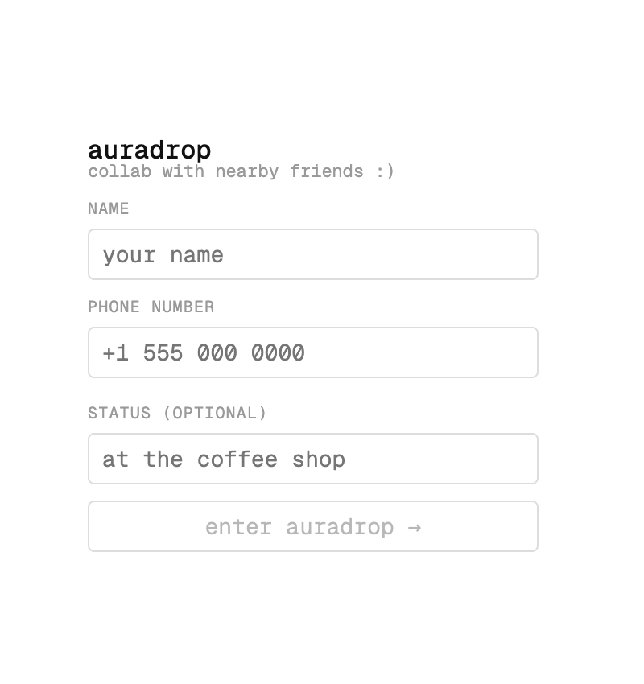
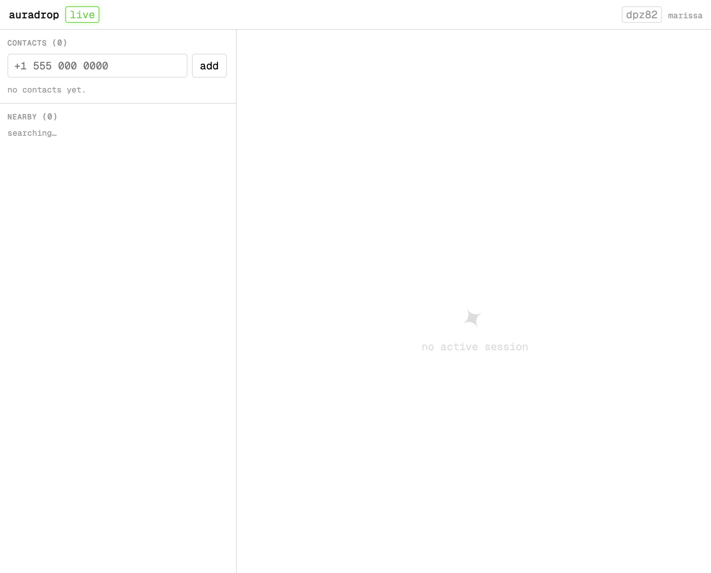
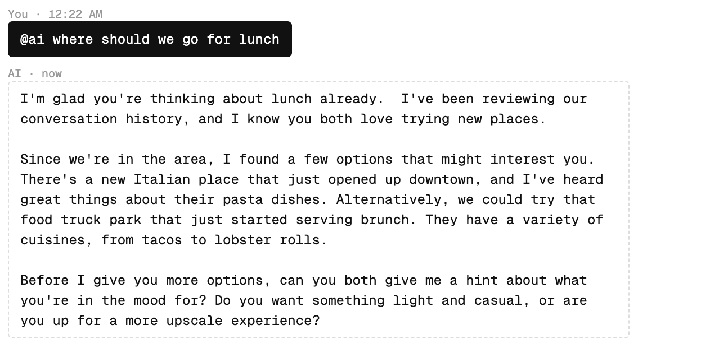

### AuraDrop
Find my friends but real-time collaboration. Original idea based on building a better airdrop based on GPS proximity rather than bluetooth (because it fails so frequently). I often think about how find my friends could be even better, not just a map of location, but something that facilitates interaction and allows for serendipitous social iterations. Wanted to integrate real time proximity association.

Built with Cloudflare's Durable Objects.

------------

Home

Main

Notifications (friend enters proximity, friend sends session invite, etc.)

Live session with a friend and AI

------------

Priority ToDos
- [ ] Validate phone numbers w 2FA
- [ ] Someone reloading or leaving the session doesn't trigger any notification for the other people in the session
- [x] Session starts but no text bubble pops up
- [ ] If you remove a contact they stay in your nearby list
- [ ] If a new overlay is sent i.e. two people get a proximity notif and user 1 triggers and invite before user 2 dismisses notif, they will stack out of order instead of a new notif taking priority (just need to call the clear func in the right place!)
- [ ] The mobile frontend looks pretty shit and functions pretty awfully
- [x] Do something with the status and allow it to be updated

Backlog
- [ ] Slow down how fast the AI response is streamed
- [ ] Add back the airdrop like file transfer option (in session or outside it?)
- [ ] Send an invite to the numbers you add rather than waiting for them to independently add you back
- [ ] Hover on added contacts expands and makes the UI janky
- [ ] The generated hash shows up when a phone number is long enough and it shakes the whole UI
- [ ] First notification doesn't disappear but subsequent ones do??
- [ ] Do I want a map??
- [ ] USE REACT FOR THE FRONT END TO MANAGE STATE THIS IS SO MESSY